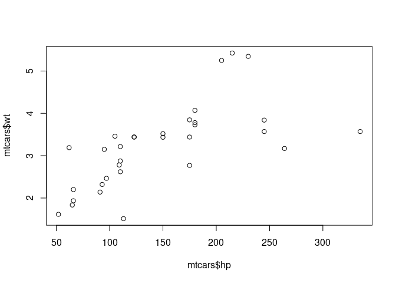

Doc learn PEC 441 % 2009
================
Dr. Camilo Cola - PMDB/ES
2023-02-22

Vectors and Vector Spaces In this chapter we discuss a wide range of
basic topics related to vectors of real numbers. Some of the properties
carry over to vectors over other fields, such as complex numbers, but the
reader should not assume this. Occasionally, for emphasis, we will refer
to “real” vectors or “real” vector spaces, but unless it is stated
otherwise, we are assuming the vectors and vector spaces are real. The
topics and the properties of vectors and vector spaces that we emphasize
are motivated by applications in the data sciences.

``` r
#!/usr/bin/r

# familiar statistical methods, such as regression analysis, principal components
# analysis, analysis of variance, multidimensional scaling, and so on.
# There are other types of structures based on graphs that are useful in
# representing data. A graph is a structure consisting of two components: a
# set of points, called vertices or nodes and a set of pairs of the points, called
# edges. (Note that this usage of the word “graph” is distinctly different from
# the more common one that refers to lines, curves, bars, and so on to represent
# data pictorially. The phrase “graph theory” is often used, or overused, to em-
# phasize the present meaning of the word.) A graph G = (V, E) with vertices
# V = {v1 , . . . , vn } is distinguished primarily by the nature of the edge elements
# (vi , vj ) in E. Graphs are identified as complete graphs, directed graphs, trees,
# and so on, depending on E and its relationship with V . A tree may be used
# for data that are naturally aggregated in a hierarchy, such as political unit,
# subunit, household, and individual. Trees are also useful for representing clus-
#   tering of data at different levels of association. In this type of representation,
# the individual data elements are the terminal nodes, or “leaves”, of the tree.


old <- par("col" = "black")

# This will be in red
c(list(col = "red", pch = 19),
         plot(mtcars$hp, mtcars$wt)
)
```

    ## $col
    ## [1] "red"
    ## 
    ## $pch
    ## [1] 19

``` r
# This will still be in black
plot(mtcars$hp, mtcars$wt)
```

<!-- -->

``` r
par(old)
```

10 1 Basic Vector/Matrix Notation of these derived objects. Because of
this, some authors try to avoid discussing or referring directly to
these objects. I do not avoid discussing the objects, but, for example,
when I write (X T X)−1 X T y, I do not mean that you should compute X T
X and X T y, then compute (X T X)−1 , and then finally multiply (X T X)−1
and X T y. I assume you know better than to do that. If you don’t know
it yet, I hope after reading this book, you will know why not to.

``` r
#!/usr/bin/r

R1 <- structure(c(1, 0.86, 0.56, 0.32, 0.85, 0.86, 1, 0.01, 0.74, 0.32, 
                  0.56, 0.01, 1, 0.65, 0.91, 0.32, 0.74, 0.65, 1, 0.36,
                  0.85, 0.32, 0.91, 0.36, 1), 
                .Dim = c(5L, 5L))
colnames(R1) <- rownames(R1) <- paste0("x", 1:ncol(R1))
R1
```

    ##      x1   x2   x3   x4   x5
    ## x1 1.00 0.86 0.56 0.32 0.85
    ## x2 0.86 1.00 0.01 0.74 0.32
    ## x3 0.56 0.01 1.00 0.65 0.91
    ## x4 0.32 0.74 0.65 1.00 0.36
    ## x5 0.85 0.32 0.91 0.36 1.00

``` r
c(R1, cutoff = .6, exact = FALSE)
```

    ##                                                                              
    ##   1.00   0.86   0.56   0.32   0.85   0.86   1.00   0.01   0.74   0.32   0.56 
    ##                                                                              
    ##   0.01   1.00   0.65   0.91   0.32   0.74   0.65   1.00   0.36   0.85   0.32 
    ##                      cutoff  exact 
    ##   0.91   0.36   1.00   0.60   0.00

``` r
c(R1, cutoff = .6, exact = TRUE)
```

    ##                                                                              
    ##   1.00   0.86   0.56   0.32   0.85   0.86   1.00   0.01   0.74   0.32   0.56 
    ##                                                                              
    ##   0.01   1.00   0.65   0.91   0.32   0.74   0.65   1.00   0.36   0.85   0.32 
    ##                      cutoff  exact 
    ##   0.91   0.36   1.00   0.60   1.00

``` r
c(R1, cutoff = .6, exact = TRUE, names = FALSE)
```

    ##                                                                              
    ##   1.00   0.86   0.56   0.32   0.85   0.86   1.00   0.01   0.74   0.32   0.56 
    ##                                                                              
    ##   0.01   1.00   0.65   0.91   0.32   0.74   0.65   1.00   0.36   0.85   0.32 
    ##                      cutoff  exact  names 
    ##   0.91   0.36   1.00   0.60   1.00   0.00

``` r
R2 <- diag(rep(1, 5))
R2[2, 3] <- R2[3, 2] <- .7
R2[5, 3] <- R2[3, 5] <- -.7
R2[4, 1] <- R2[1, 4] <- -.67

corrDF <- expand.grid(row = 1:5, col = 1:5)
corrDF$correlation <- as.vector(R2)
c(correlation ~ row + col, corrDF)
```

    ## [[1]]
    ## correlation ~ row + col
    ## 
    ## $row
    ##  [1] 1 2 3 4 5 1 2 3 4 5 1 2 3 4 5 1 2 3 4 5 1 2 3 4 5
    ## 
    ## $col
    ##  [1] 1 1 1 1 1 2 2 2 2 2 3 3 3 3 3 4 4 4 4 4 5 5 5 5 5
    ## 
    ## $correlation
    ##  [1]  1.00  0.00  0.00 -0.67  0.00  0.00  1.00  0.70  0.00  0.00  0.00  0.70
    ## [13]  1.00  0.00 -0.70 -0.67  0.00  0.00  1.00  0.00  0.00  0.00 -0.70  0.00
    ## [25]  1.00

``` r
c(R2, cutoff = .65, verbose = TRUE)
```

    ##                                                                                 
    ##    1.00    0.00    0.00   -0.67    0.00    0.00    1.00    0.70    0.00    0.00 
    ##                                                                                 
    ##    0.00    0.70    1.00    0.00   -0.70   -0.67    0.00    0.00    1.00    0.00 
    ##                                          cutoff verbose 
    ##    0.00    0.00   -0.70    0.00    1.00    0.65    1.00

``` r
c(R2, cutoff = .99, verbose = TRUE)
```

    ##                                                                                 
    ##    1.00    0.00    0.00   -0.67    0.00    0.00    1.00    0.70    0.00    0.00 
    ##                                                                                 
    ##    0.00    0.70    1.00    0.00   -0.70   -0.67    0.00    0.00    1.00    0.00 
    ##                                          cutoff verbose 
    ##    0.00    0.00   -0.70    0.00    1.00    0.99    1.00

What You Compute and What You Don’t The applied mathematician or
statistician routinely performs many computa- tions involving vectors
and matrices. Many of those computations follow the methods discussed in
this text. For a given matrix X, I will often refer to its inverse X −1
, its determinant det(X), its Gram X T X, a matrix formed by permuting
its columns E(π) X, a matrix formed by permuting its rows XE(π) , and
other transformations of the given matrix X. These derived objects are
very important and useful. Their usefulness, however, is primarily
conceptual. When working with a real matrix X whose elements have actual
known values, it is not very often that we need or want the actual
values of elements

``` r
#!/usr/bin/r


# A major consideration, of course, is the nature of the individual items of
# data. The observational data may be in various forms: quantitative measures,
# colors, text strings, and so on. Prior to most analyses of data, they must be
# represented as real numbers. In some cases, they can be represented easily
# as real numbers, although there may be restrictions on the mapping into the
# reals. (For example, do the data naturally assume only integral values, or
# could any real number be mapped back to a possible observation?)
pander::add.blank.lines(0)
```

    ## [1] "\n0\n"

``` r
# The most common way of representing data is by using a two-dimensional
# array in which the rows correspond to observational units (“instances”) and
# the columns correspond to particular types of observations (“variables” or
# “features”). If the data correspond to real numbers, this representation is the
# familiar X data matrix. Much of this book is devoted to the matrix theory
# and computational methods for the analysis of data in this form. This type of
# matrix, perhaps with an adjoined vector, is the basic structure used in many

## ---- include = FALSE---------------------------------------------------------
knitr::opts_chunk$set(
  collapse = TRUE,
  comment = "#>"
)

## ----setup--------------------------------------------------------------------
library(warp)

## -----------------------------------------------------------------------------
before_dst <- as.POSIXct("2023-04-26 01:59:59", tz = "America/New_York")
before_dst
```

    ## [1] "2023-04-26 01:59:59 EDT"

``` r
before_dst + 1
```

    ## [1] "2023-04-26 02:00:00 EDT"

``` r
## -----------------------------------------------------------------------------
x <- as.POSIXct("2023-04-26 00:00:00", tz = "America/New_York") + 3600 * 0:7

data.frame(
  x = x,
  hour = warp_distance(x, "hour", every = 2)
)
```

    ##                     x   hour
    ## 1 2023-04-26 00:00:00 233675
    ## 2 2023-04-26 01:00:00 233676
    ## 3 2023-04-26 02:00:00 233676
    ## 4 2023-04-26 03:00:00 233677
    ## 5 2023-04-26 04:00:00 233677
    ## 6 2023-04-26 05:00:00 233678
    ## 7 2023-04-26 06:00:00 233678
    ## 8 2023-04-26 07:00:00 233679

``` r
## -----------------------------------------------------------------------------
y <- as.POSIXct("1970-04-26 22:00:00", tz = "America/New_York") + 3600 * 0:5

data.frame(
  y = y,
  hour = warp_distance(y, "hour", every = 2)
)
```

    ##                     y hour
    ## 1 1970-04-26 22:00:00 1390
    ## 2 1970-04-26 23:00:00 1391
    ## 3 1970-04-27 00:00:00 1391
    ## 4 1970-04-27 01:00:00 1392
    ## 5 1970-04-27 02:00:00 1392
    ## 6 1970-04-27 03:00:00 1393

``` r
## -----------------------------------------------------------------------------
# Or call `lubridate::force_tz(x, "UTC")`
force_utc <- function(x) {
  x_lt <- as.POSIXlt(x)
  x_lt <- unclass(x_lt)
  
  attributes(x) <- NULL
  
  out <- x + x_lt$gmtoff
  
  as.POSIXct(out, tz = "UTC", origin = "1970-01-01")
}

x_utc <- force_utc(x)
y_utc <- force_utc(y)

x_utc
```

    ## [1] "2023-04-26 00:00:00 UTC" "2023-04-26 01:00:00 UTC"
    ## [3] "2023-04-26 02:00:00 UTC" "2023-04-26 03:00:00 UTC"
    ## [5] "2023-04-26 04:00:00 UTC" "2023-04-26 05:00:00 UTC"
    ## [7] "2023-04-26 06:00:00 UTC" "2023-04-26 07:00:00 UTC"

``` r
## -----------------------------------------------------------------------------
data.frame(
  x_utc = x_utc,
  hour = warp_distance(x_utc, "hour", every = 2)
)
```

    ##                 x_utc   hour
    ## 1 2023-04-26 00:00:00 233676
    ## 2 2023-04-26 01:00:00 233676
    ## 3 2023-04-26 02:00:00 233677
    ## 4 2023-04-26 03:00:00 233677
    ## 5 2023-04-26 04:00:00 233678
    ## 6 2023-04-26 05:00:00 233678
    ## 7 2023-04-26 06:00:00 233679
    ## 8 2023-04-26 07:00:00 233679

``` r
data.frame(
  y_utc = y_utc,
  hour = warp_distance(y_utc, "hour", every = 2)
)
```

    ##                 y_utc hour
    ## 1 1970-04-26 22:00:00 1391
    ## 2 1970-04-26 23:00:00 1391
    ## 3 1970-04-27 00:00:00 1392
    ## 4 1970-04-27 01:00:00 1392
    ## 5 1970-04-27 02:00:00 1393
    ## 6 1970-04-27 03:00:00 1393

``` r
## -----------------------------------------------------------------------------
before_fallback <- as.POSIXct("2023-10-25 01:00:00", tz = "America/New_York")
before_fallback
```

    ## [1] "2023-10-25 01:00:00 EDT"

``` r
# add 1 hour of seconds
before_fallback + 3600
```

    ## [1] "2023-10-25 02:00:00 EDT"

``` r
## -----------------------------------------------------------------------------
x <- as.POSIXct("2023-10-25 00:00:00", tz = "America/New_York") + 3600 * 0:7
x
```

    ## [1] "2023-10-25 00:00:00 EDT" "2023-10-25 01:00:00 EDT"
    ## [3] "2023-10-25 02:00:00 EDT" "2023-10-25 03:00:00 EDT"
    ## [5] "2023-10-25 04:00:00 EDT" "2023-10-25 05:00:00 EDT"
    ## [7] "2023-10-25 06:00:00 EDT" "2023-10-25 07:00:00 EDT"

``` r
data.frame(
  x = x,
  hour = warp_distance(x, "hour", every = 2)
)
```

    ##                     x   hour
    ## 1 2023-10-25 00:00:00 235859
    ## 2 2023-10-25 01:00:00 235860
    ## 3 2023-10-25 02:00:00 235860
    ## 4 2023-10-25 03:00:00 235861
    ## 5 2023-10-25 04:00:00 235861
    ## 6 2023-10-25 05:00:00 235862
    ## 7 2023-10-25 06:00:00 235862
    ## 8 2023-10-25 07:00:00 235863

``` r
## -----------------------------------------------------------------------------
y <- as.POSIXct("2023-10-25 22:00:00", tz = "America/New_York") + 3600 * 0:5
y
```

    ## [1] "2023-10-25 22:00:00 EDT" "2023-10-25 23:00:00 EDT"
    ## [3] "2023-10-26 00:00:00 EDT" "2023-10-26 01:00:00 EDT"
    ## [5] "2023-10-26 02:00:00 EDT" "2023-10-26 03:00:00 EDT"

``` r
data.frame(
  y = y,
  hour = warp_distance(y, "hour", every = 2)
)
```

    ##                     y   hour
    ## 1 2023-10-25 22:00:00 235870
    ## 2 2023-10-25 23:00:00 235871
    ## 3 2023-10-26 00:00:00 235871
    ## 4 2023-10-26 01:00:00 235872
    ## 5 2023-10-26 02:00:00 235872
    ## 6 2023-10-26 03:00:00 235873

``` r
## -----------------------------------------------------------------------------
x_utc <- force_utc(x)
x_utc
```

    ## [1] "2023-10-25 00:00:00 UTC" "2023-10-25 01:00:00 UTC"
    ## [3] "2023-10-25 02:00:00 UTC" "2023-10-25 03:00:00 UTC"
    ## [5] "2023-10-25 04:00:00 UTC" "2023-10-25 05:00:00 UTC"
    ## [7] "2023-10-25 06:00:00 UTC" "2023-10-25 07:00:00 UTC"

``` r
## -----------------------------------------------------------------------------
data.frame(
  x_utc = x_utc,
  hour = warp_distance(x_utc, "hour", every = 2)
)
```

    ##                 x_utc   hour
    ## 1 2023-10-25 00:00:00 235860
    ## 2 2023-10-25 01:00:00 235860
    ## 3 2023-10-25 02:00:00 235861
    ## 4 2023-10-25 03:00:00 235861
    ## 5 2023-10-25 04:00:00 235862
    ## 6 2023-10-25 05:00:00 235862
    ## 7 2023-10-25 06:00:00 235863
    ## 8 2023-10-25 07:00:00 235863

familiar statistical methods, such as regression analysis, principal
components analysis, analysis of variance, multidimensional scaling, and
so on. There are other types of structures based on graphs that are
useful in representing data. A graph is a structure consisting of two
components: a set of points, called vertices or nodes and a set of pairs
of the points, called edges. (Note that this usage of the word “graph”
is distinctly different from the more common one that refers to lines,
curves, bars, and so on to represent data pictorially. The phrase “graph
theory” is often used, or overused, to em- phasize the present meaning
of the word.) A graph G = (V, E) with vertices V = {v1 , . . . , vn } is
distinguished primarily by the nature of the edge elements (vi , vj ) in
E. Graphs are identified as complete graphs, directed graphs, trees, and
so on, depending on E and its relationship with V . A tree may be used
for data that are naturally aggregated in a hierarchy, such as political
unit, subunit, household, and individual. Trees are also useful for
representing clus- tering of data at different levels of association. In
this type of representation, the individual data elements are the
terminal nodes, or “leaves”, of the tree. In another type of graphical
representation that is often useful in “data mining” or “learning”,
where we seek to uncover relationships among objects, the vertices are
the objects, either observational units or features, and the edges
indicate some commonality between vertices. For example, the vertices
may be text documents, and an edge between two documents may indicate
that a certain number of specific words or phrases occur in both
documents. Despite the differences in the basic ways of representing
data, in graphical modeling of data, many of the standard matrix
operations used in more tra- ditional data analysis are applied to
matrices that arise naturally from the graph. However the data are
represented, whether in an array or a network, the analysis of the data
is often facilitated by using “association” matrices. The most familiar
type of association matrix is perhaps a correlation matrix. We will
encounter and use other types of association matrices in Chap. 8.
